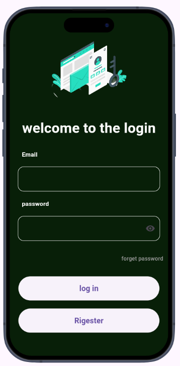
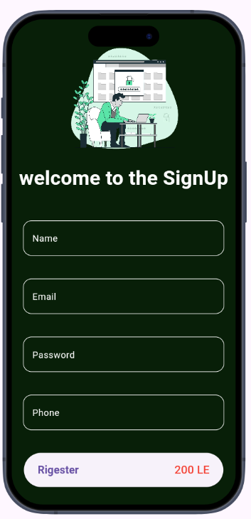
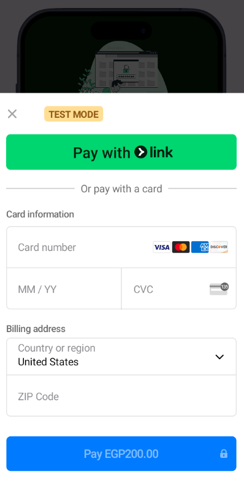
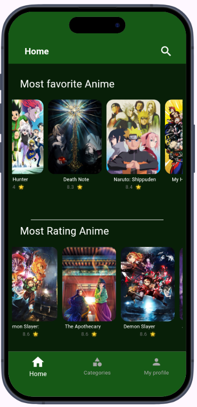
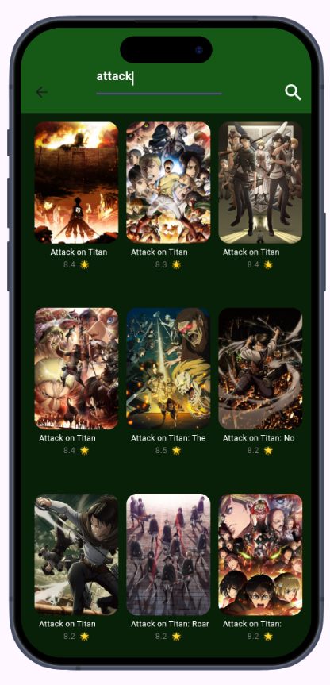
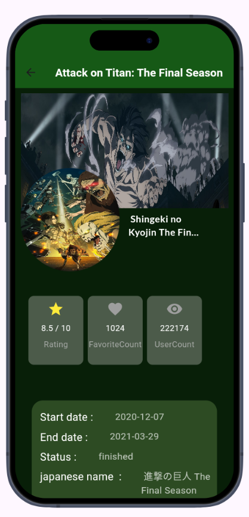
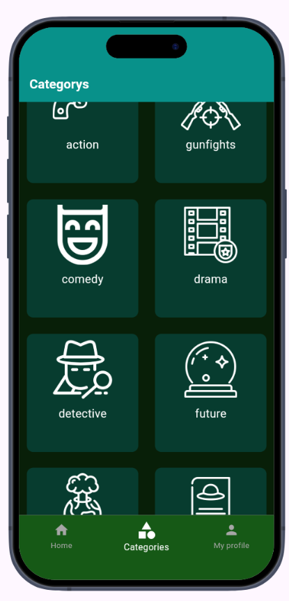

# 🎬 Animena

Animena is a modern **Flutter mobile app** designed for anime lovers.  
The app provides anime discovery, categories, search, and authentication with **Firebase**.  
Premium users can register through **Stripe payment integration**.  

---

## 📸 Screenshots
### 📺 App Register
<div align="center">
  <table>
    <tr>
      <td align="center">
        
        <br><b>SignIn</b>
      </td>
      <td align="center">
        
        <br><b>Sign Up</b>
      </td>
      <td align="center">
        
        <br><b>Signup Payment</b>
      </td>     
    </tr>   
  </table>
</div>

### 🎬 App Features   
<div align="center">
  <table>
    <tr>
      <td align="center">
        
        <br><b>Home Screen</b>
      </td>
      <td align="center">
        
        <br><b>Search Main</b>
      </td>
      <td align="center">
        
        <br><b>Anime Details</b>
      </td>
      <td align="center">
        
        <br><b>Catigories Page</b>
      </td>
    </tr>
  </table>
</div>
---

## ✨ Features

- 🔥 Browse trending, top-rated, and most-viewed anime.  
- 🎭 Explore anime by genres (Action, Comedy, Romance, Horror, etc.).  
- 🔍 Search anime using public APIs.  
- 👤 Authentication with **Firebase** (Login / Register).  
- 💳 Registration requires **Stripe Payment** for premium access.  
- 📱 Smooth, responsive UI for Android & iOS.  

---

## 🛠️ Tech Stack

- **Framework**: Flutter (Dart)  
- **Authentication**: Firebase Auth  
- **Database**: Firestore  
- **Payments**: Stripe  
- **Data Source**: External Anime APIs  

---

## 📂 Project Structure

Your project follows **Clean Architecture** with clear separation of concerns:
    
    lib/
    ┣ core/ # Core utilities, themes, constants
    ┣ features/ # Each feature is modular
    ┃ ┣ auth/ # Authentication (login/register)
    ┃ ┗ home/ # Home & anime discovery
    ┃   ┣ data/ # Data Layer
    ┃   ┃ ┣ models/ # Data models
    ┃   ┃ ┣ repository/ # Repository (data sources)
    ┃   ┃ ┗ services/ # API/Service calls
    ┃   ┗ presentation/ # Presentation Layer
    ┃     ┣ cubit/Anime_data # State Management (Cubit/BLoC)
    ┃     ┗ views/ # Screens/Views
    ┃       ┣ pages/ # Pages
    ┃       ┗ widgets/ # UI Widgets
    ┗ main.dart # Entry point


---

## 🚀 Getting Started

### Prerequisites
- Install [Flutter SDK](https://docs.flutter.dev/get-started/install)  
- Firebase project configured  
- Stripe account setup  

### Installation

1. Clone the repo:
   ```bash
   git clone https://github.com/your-username/animena.git
   cd animena

---


## 👨‍💻 Author

### Developed by Amr Ali 🚀
[GitHub](https://github.com/Amr-3li) | [LinkedIn](https://www.linkedin.com/in/amr-ali1/)
